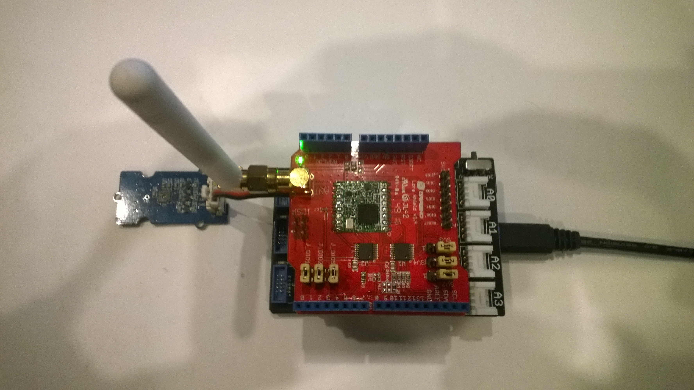
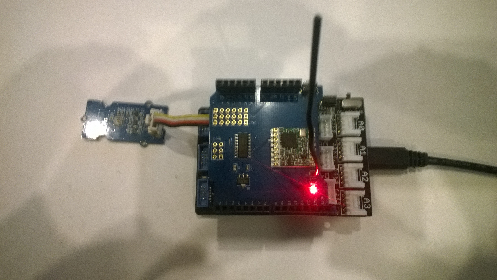
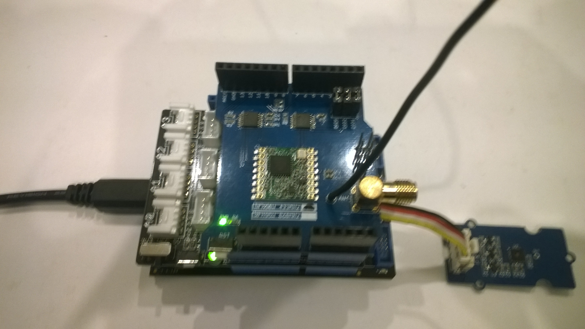

# FieldGateway.LoRa.NetduinoNFClient
Sample plug n play [Netduino 3 Wifi](https://www.wildernesslabs.co/) (running the [nanoFramework](https://nanoframework.net/)) client for my [LoRa](https://lora-alliance.org/) field gateway projects

The [RFM9XLoRa-NetNF](https://github.com/KiwiBryn/RFM9XLoRa-NetNF) and [Silicon Labs Si7005](https://www.silabs.com/products/sensors/humidity/si7005) temperature and humidity sensor drivers are my own work.

My Netduino clients use
* LoRa Arduino shield
  * Dragino 433/868/915Mz (http://www.dragino.com/products/lora/item/102-lora-shield.html)
  * Elecrow 915MHz (https://www.elecrow.com/lora-rfm95-shield-915mhz.html)
  * MakerFabs 433MHz (https://makerfabs.com/index.php?route=product/product&product_id=131)
  * MakerFabs 868MHz (https://makerfabs.com/index.php?route=product/product&product_id=130)
* [SeeedStudio Grove-Temperature & Humidity Sensor ](https://www.seeedstudio.com/Grove-Temperature%26Humidity-Sensor-%28High-Accuracy-%26-Mini%29-p-1921.html)
* [SeeedStudio Grove-Universal 4 Pin Buckled 5cm Cable](https://www.seeedstudio.com/Grove-Universal-4-Pin-Buckled-5cm-Cable-%285-PCs-Pack%29-p-925.html)
* [SeeedStudio Grove-Base Shield V2](https://www.seeedstudio.com/Base-Shield-V2-p-1378.html)
* [Netduino V3 Wifi device](https://www.wildernesslabs.co/Netduino)
* NanoFramework for Netduino 3 Wifi(https://docs.nanoframework.net/content/reference-targets/netduino3-wifi.html)

Dragino 

Elecrow

MakerFabs

